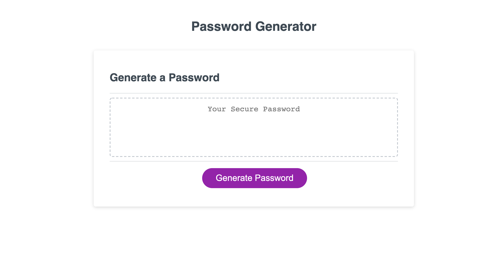

# HW3-Password-Generator

## Description

In order to practice newly learned Javascript skills, it was important to apply these skills to a real world application.  This password generator is important to uphold password privacy and to easily generate a high security password with a click of a button.  With the selectable paramters in the application the use can customize it however they like in order to get something truly unique.  

## Usage 

Follow the link to the live website, when the press the purple button the window will generate a text box asking the length of the password you would like between 8 - 128, then you will select Ok or Cancel to determine if you would like to include the following, uppercase letters, lowercase letters, numbers, and symbols.  After all selections have been made, the site will generate you a random password with your selected paramaters.  

## Links

[Link to the Repo](https://github.com/madison-vega/HW3-Password-Generator)    
[Link to the live site](https://madison-vega.github.io/HW3-Password-Generator/index.html)

 
## License

MIT License

Copyright (c) [2021] [MadisonVega]

Permission is hereby granted, free of charge, to any person obtaining a copy
of this software and associated documentation files (the "Software"), to deal
in the Software without restriction, including without limitation the rights
to use, copy, modify, merge, publish, distribute, sublicense, and/or sell
copies of the Software, and to permit persons to whom the Software is
furnished to do so, subject to the following conditions:

The above copyright notice and this permission notice shall be included in all
copies or substantial portions of the Software.

THE SOFTWARE IS PROVIDED "AS IS", WITHOUT WARRANTY OF ANY KIND, EXPRESS OR
IMPLIED, INCLUDING BUT NOT LIMITED TO THE WARRANTIES OF MERCHANTABILITY,
FITNESS FOR A PARTICULAR PURPOSE AND NONINFRINGEMENT. IN NO EVENT SHALL THE
AUTHORS OR COPYRIGHT HOLDERS BE LIABLE FOR ANY CLAIM, DAMAGES OR OTHER
LIABILITY, WHETHER IN AN ACTION OF CONTRACT, TORT OR OTHERWISE, ARISING FROM,
OUT OF OR IN CONNECTION WITH THE SOFTWARE OR THE USE OR OTHER DEALINGS IN THE
SOFTWARE.